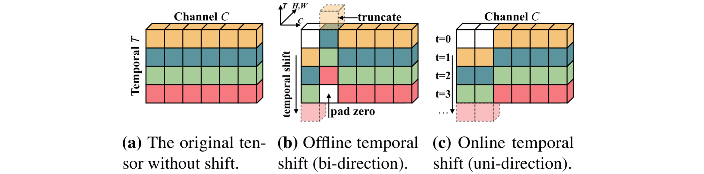

## TSM (ICCV'19) action recognition Tutorial for BYRers

***



### 1. 环境配置

```bash
git clone XXX
conda create -n action python=3.9
conda activate action
conda install pytorch torchvision pytorch-cuda=11.8 -c pytorch -c nvidia -y
pip install -r requirements.txt
```

### 2. 下载预训练权重
```bash
bash pretrained/download.sh
```


### 3. Kinetics-400数据集准备
首先批量下载训练集和验证集压缩包：
```bash
mkdir p ~/Data/Kinetics-400 && cd ~/Data/Kinetics-400
bash ~/Code/TSM/data/download.sh ~/Code/TSM/data/train_link.list
bash ~/Code/TSM/data/download.sh ~/Code/TSM/data/val_link.list
```
解压数据集，路径基本格式为：
```bash
$~/Data/Kinetics-400/train/     
$~/Data/Kinetics-400/test/                      
$~/Data/Kinetics-400/train/abseiling/
...
$~/Data/Kinetics-400/test/abseiling/
...
```
把视频拆分成帧，由于磁盘容量限制，这里仅拆分验证集，路径是：~/Data/Kinetics-400/val_frame
```bash
mkdir -p ~/Data/Kinetics-400/val_frame && cd tools
python vid2img_kinetics.py ~/Data/Kinetics-400/val ~/Data/Kinetics-400/val_frame
```
生成标签，路径在：~/Code/TSM/data/val_videofolder.txt，生成格式是：<图像相对路径 jepg数量 类别>
```bash
python tools/gen_label_kinetics_val.py
```

若要生成训练集，只需将上述路径中的val替换为train即可，路径是：~/Data/Kinetics-400/train_frame
```bash
mkdir -p ~/Data/Kinetics-400/train_frame && cd tools
python vid2img_kinetics.py ~/Data/Kinetics-400/train ~/Data/Kinetics-400/train_frame
python tools/gen_label_kinetics_train.py
```
生成标签，路径在：~/Code/TSM/data/train_videofolder.txt

### 4. 训练
```bash
bash scripts/train_tsm_kinetics_rgb_8f.sh
```

### 5. 测试
```bash
bash scripts/test_tsm_kinetics_rgb_8f.sh
```


### 6. 参考
- [TSM: Temporal Shift Module for Efficient Video Understanding](https://arxiv.org/abs/1811.08383)
- [official repo](https://github.com/mit-han-lab/temporal-shift-module)
- [official Kinetics准备](https://github.com/cvdfoundation/kinetics-dataset)
- [PaddlePaddle Kinetics准备](https://github.com/PaddlePaddle/PaddleVideo/blob/develop/docs/zh-CN/dataset/k400.md)
- [CSDN blog Kinetics准备](https://blog.csdn.net/qq_32464609/article/details/136209964)